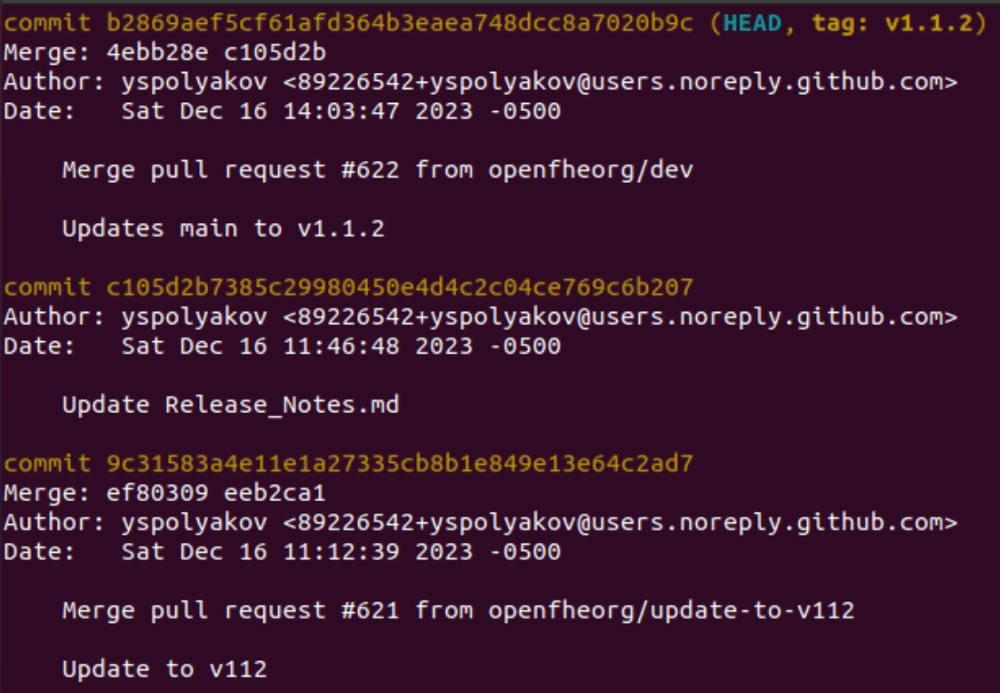
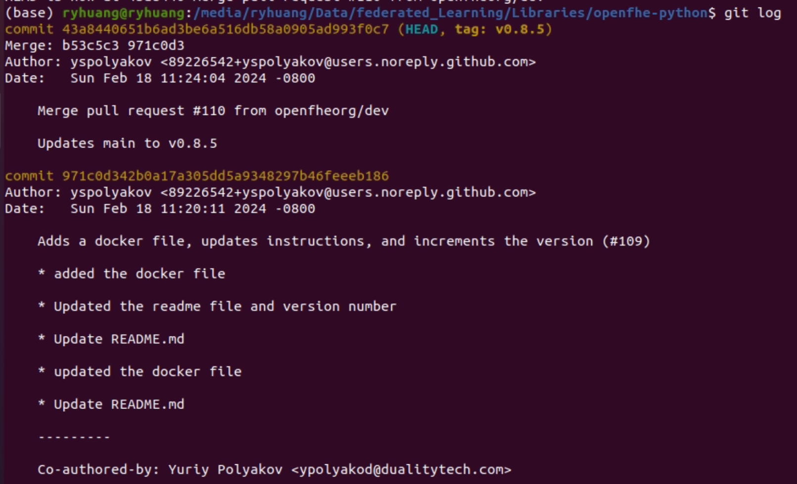
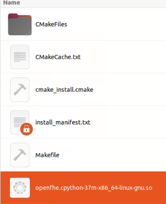
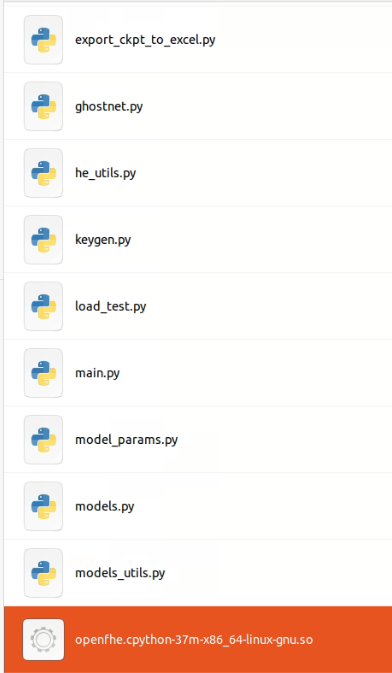

# Federated Visual Classification (PyTorch):
This code applies homomorphic encryption (CKKS scheme) to federated learning. Clients train and encrypt models, the server aggregates on encrypted models without knowing the exact model parameters.

## Environment
This code is executed under the envrionment listed below:
- Ubuntu 20.04.2
- Cuda + Cudnn
- Python 3.7
- g++ 9.4.0
- anaconda 4.8.2

## Requirements for Python
Please refer to `requirements.txt` for all used packages
```
matplotlib==3.5.3
numpy==1.21.6
scikit_learn==1.0.2
timm==0.9.12
torch==1.13.1
torchaudio==0.13.1
torchinfo==1.8.0
torchsummary==1.5.1
torchtext==0.14.1
torchvision==0.14.1
```

## Install OpenFHE
OpenFHE requires developers to compile the source code (C++) and Python wrapper.
**Compiling C++ source code** <br>
https://openfhe-development.readthedocs.io/en/latest/sphinx_rsts/intro/installation/linux.html<br>

1. Install packages on the system:<br> `sudo apt-get install build-essential cmake clang libomp5 libomp-dev autoconf`
2. Setup clang: Run the following two commands to configure clang/clang++ as the default compiler for C and C++ (default paths are used here). For clang 11:<br>
    `export CC=/usr/bin/clang-11`<br>
    `export CXX=/usr/bin/clang++-11`

    For a default version of clang, e.g., v6 in Ubuntu 20.04:<br>
    `export CC=/usr/bin/clang`<br>
    `export CXX=/usr/bin/clang++`

3. `git clone https://github.com/openfheorg/openfhe-development.git`

4. Make sure the version is v1.1.2:<br>
    `cd openfhe-development`<br>
    `git checkout v1.1.2`<br>

     

5. Compile: at the directory `<path to openfhe-development>/openfhe-development`:<br>
    `mkdir build`<br>
    `cd build`<br>
    `cmake ..`<br>
    `make`<br>
    `make install`<br>

6. Test installation:<br>
    Run unit tests to make sure all capabilities operate as expected: <br>
    `sudo make testall`<br>

    Run sample code to test:<br>
    `bin/examples/pke/simple-integers`<br>


**Compiling Python wrapper**<br>
https://github.com/openfheorg/openfhe-python <br>

1. `git clone https://github.com/openfheorg/openfhe-python.git`

2. Make sure the version is v0.8.5:<br>
    `cd openfhe-python`<br>
    `git checkout v0.8.5`<br>

    

3. Install required package in Python:<br>
`pip install "pybind11[global]"`<br>

4. At the directory `<path to openfhe-python>/openfhe-python`:<br>
    `mkdir build`<br>
    `cd build`<br>
    `cmake ..  # Alternatively, cmake .. -DOpenFHE_DIR=/path/to/installed/openfhe if you installed OpenFHE elsewhere`<br>
    `make`<br>
    `make install  # You may have to run sudo make install`<br>


5. Test (https://github.com/openfheorg/openfhe-python/blob/main/tests/README.md):<br>
    `python -c "__import__('openfhe')"`<br>

6. Copy compiled `openfhe.cpython-37m-x86_64-linux-gnu.so` to `<path to test code>/Federated-Learning-PyTorch_HE_share/src/`

- Compiled file:<br>
  


- Copied file to test code:<br>
  

## Install Pyfhel and TenSeal<br>
`pip install tenseal==0.3.14`<br>
`pip install Pyfhel==3.4.2`<br>


## Experiments
### Models to be tested:
lenet, mobilenet_v1, mobilenet_v2, mobilenet_V3, resnet18, resnet34, resnet50, efficientnetb0, efficientnetb5, efficientnetb7

### Test of speed
- 3 clients
- 5 training rounds
- 1 local epoch
- batch size = 16 (lower batchsize for efficientnet b7 because it requires much memory)

### Accuracy
- 3 clients
- 10 training rounds
- 5 local epoch
- batch size = 16 (lower batchsize for efficientnet b7 because it requires much memory)

## Test
Before executing, please make sure the terminal switch to the virtual environment if using anaconda

`python -u main.py --he_lib TenSeal_CKKS_without_flatten --ring_dim 8192 --scale_bit 52 --model lenet_DLG --dataset cifar100 --s_ratio 0.5 --s_method magnitude --load_map false`

## Script to call execution
Before executing the script, please make sure the terminal switch to the virtual environment if using anaconda

`<path to test code>/Federated-Learning-PyTorch_HE_share/execute.sh` calls test with set arguments, and logs down execution accuracy to `<path to test code>/<HE_library>_<model arch>_<ring dimension>_<scale bit>_<date>.log`.<br>
For example: OpenFHE_mobilenet_v3_4096_14_20240805.log records the content using OpenFHE to encrypt mobilnetv3, the ring dimension is 4096, and scale bit is 14.

In addition, execution time are recorded and saved as Python dictionary, which is stored at `<path to test code>/save/<HE_library>_<ring dimension>_<scale bit>_<date time>`.<br>
For example: OpenFHE_CKKS_4096_14_2024-08-12_19-19-24 records the content using OpenFHE, the ring dimension is 4096, and scale bit is 14.
Script `<path to test code>/src/export_ckpt_to_excel.py` and `call_export_ckpt_to_excel.sh` can be used to export time execution to excel files, but currently supports settings for 3 clients, 5 training rounds, and 1 local epoch.


## Help
The arguments values are set in options.py, and main.py is executed with all setup arguments.
```
usage: python main.py [ARGUMENTS]

algorithm arguments:
  --rounds ROUNDS       number of communication rounds, or number of epochs if
                        --centralized (default: 200)
  --iters ITERS         number of iterations: the iterations of a round are
                        determined by the client with the largest number of
                        images (default: None)
  --num_clients NUM_CLIENTS, -K NUM_CLIENTS
                        number of clients (default: 100)
  --frac_clients FRAC_CLIENTS, -C FRAC_CLIENTS
                        fraction of clients selected at each round (default:
                        0.1)
  --train_bs TRAIN_BS, -B TRAIN_BS
                        client training batch size, 0 to use the whole
                        training set (default: 50)
  --epochs EPOCHS, -E EPOCHS
                        number of client epochs (default: 5)
  --hetero HETERO       probability of clients being stragglers, i.e. training
                        for less than EPOCHS epochs (default: 0)
  --drop_stragglers     drop stragglers (default: False)
  --server_lr SERVER_LR
                        server learning rate (default: 1)
  --server_momentum SERVER_MOMENTUM
                        server momentum for FedAvgM algorithm (default: 0)
  --mu MU               mu parameter for FedProx algorithm (default: 0)
  --centralized         use centralized algorithm (default: False)
  --fedsgd              use FedSGD algorithm (default: False)
  --fedir               use FedIR algorithm (default: False)
  --vc_size VC_SIZE     use FedVC algorithm with virtual client size VC_SIZE
                        (default: None)

dataset and split arguments:
  --dataset {cifar10,fmnist,mnist}
                        dataset, place yours in datasets.py (default: cifar10)
  --dataset_args DATASET_ARGS
                        dataset arguments (default: augment=True)
  --frac_valid FRAC_VALID
                        fraction of the training set to use for validation
                        (default: 0)
  --iid IID             identicalness of client distributions (default: inf)
  --balance BALANCE     balance of client distributions (default: inf)

model, optimizer and scheduler arguments:
  --model {cnn_cifar10,cnn_mnist,efficientnet,ghostnet,lenet5,lenet5_orig,mlp_mnist,mnasnet,mobilenet_v3}
                        model, place yours in models.py (default: lenet5)
  --model_args MODEL_ARGS
                        model arguments (default: ghost=True,norm=None)
  --optim {adam,sgd}    optimizer, place yours in optimizers.py (default: sgd)
  --optim_args OPTIM_ARGS
                        optimizer arguments (default:
                        lr=0.01,momentum=0,weight_decay=4e-4)
  --sched {const,fixed,plateau_loss,step}
                        scheduler, place yours in schedulers.py (default:
                        fixed)
  --sched_args SCHED_ARGS
                        scheduler arguments (default: None)

output arguments:
  --client_stats_every CLIENT_STATS_EVERY
                        compute and print client statistics every
                        CLIENT_STATS_EVERY batches, 0 for every epoch
                        (default: 0)
  --server_stats_every SERVER_STATS_EVERY
                        compute, print and log server statistics every
                        SERVER_STATS_EVERY rounds (default: 1)
  --name NAME           log to runs/NAME and save checkpoints to save/NAME,
                        None for YYYY-MM-DD_HH-MM-SS (default: None)
  --no_log              disable logging (default: False)
  --no_save             disable checkpoints (default: False)
  --quiet, -q           less verbose output (default: False)

other arguments:
  --test_bs TEST_BS     client test/validation batch size (default: 256)
  --seed SEED           random seed (default: 0)
  --device {cuda:0,cpu}
                        device to train/validate/test with (default: cuda:0)
  --resume              resume experiment from save/NAME checkpoint (default:
                        False)
  --help, -h            show this help message and exit (default: False)

Homomorphic encryption related arguments
  --he_lib              library for homomorphic encryption, available choice:
                        OpenFHE_CKKS, TenSeal_CKKS_without_flatten, Pyfhel_CKKS
  --ring_dim            ring dimension (polynomial degree) for CKKS scheme:
                        [1024, 2048, 4096, 8192]
  --scale_bit           scaling bit size, available options: [14, 20, 33, 40, 52]

Sensitivity map related arguments
  --load_map          load generated sensitivity map or not, available options: True, False
  --load_smap_dir     path to the generated sensitivity map
  --s_ratio           encryption ratio [0, 1]
  --s_method          methods to generate sensitivity maps, available options: magnitude, jacobian
```